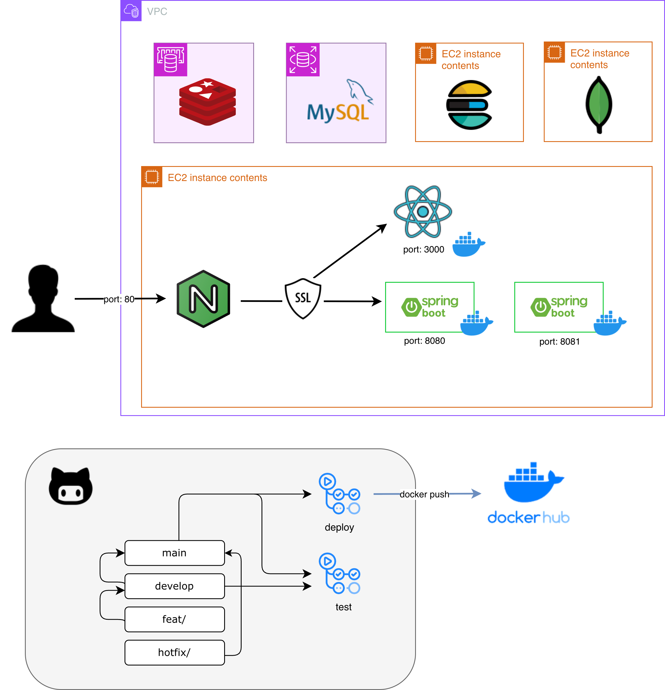

# 고객 상담 기록 관리 및 요약/분석 서비스

## 상담4도와조

| 이름                                                              | 역할 | 담당 기능                                     |
| ----------------------------------------------------------------- | ---- | --------------------------------------------- |
| [정하람 (@CoderGogh)](https://github.com/CoderGogh)               | 팀장 | 프로젝트 총괄, 검색 시스템 구현               |
| [장혜진 (@aaxx98)](https://github.com/aaxx98)                     | 팀원 | 배포 설정, 요약 배치 구현                     |
| [이민석 (@cvcf123)](https://github.com/cvcf123)                   | 팀원 | 상담 결과서 및 상담 내역 기능 구현            |
| [이유진 (@Ujin28)](https://github.com/Ujin28)                     | 팀원 | 전체 분석 리포트 기능 구현                    |
| [이윤경 (@coding-quokka101)](https://github.com/coding-quokka101) | 팀원 | 전체 분석 리포트 기능 구현                    |
| [양해강 (@Inoansta)](https://github.com/Inoansta)                 | 팀원 | 프론트엔드 개발                               |
| [조승혁 (@nish1107)](https://github.com/nish1107)                 | 팀원 | AI 데이터 추출, 매뉴얼 및 우수 사례 기능 구현 |

## 1. 프로젝트 개요

본 프로젝트는 통신사 상담 환경을 가정하여, 상담 데이터를 단순 저장 수준에서 벗어나 **요약 및 분석 기반으로 활용할 수 있도록 하는 시스템**을 구현하는 것을 목표로 한다.

상담 대화 내용과 상담 정보를 구조화하여 저장하고, 이를 기반으로 **요약, 키워드 분석, 품질 평가** 기능을 제공함으로써 상담 업무 효율성과 데이터 활용도를 향상시키는 데 목적이 있다.

## 2. 기획 배경

콜센터 환경에서는 하루 수만 건 이상의 상담 데이터가 생성되지만, 대부분 기록으로만 남고 실제 운영 개선이나 의사결정에는 충분히 활용되지 못한다.

이로 인해 다음과 같은 문제가 발생한다.

- 상담 이력 재활용 어려움
- 반복 문의 대응 비효율
- 상담 품질 관리의 어려움
- 데이터 기반 인사이트 도출 한계

본 프로젝트는 이러한 문제를 해결하기 위해 **상담 데이터를 구조화하고 분석 가능한 형태로 전환**하는 데 초점을 둔다.

## 3. 프로젝트 목표

- 상담 기록 저장 및 조회 시스템 구축
- 상담 데이터 기반 요약 자동화
- 키워드 추출, 집계, 상품 가입/해지 데이터 분석을 통한 상담/운영 인사이트 제공
- 상담 품질 평가 기능 제공
- 매뉴얼 및 유사 상담, 우수 상담 탐색을 통한 상담 업무 지원

## 4. 주요 기능

### 4.1 상담 기록 관리

- 상담 대화 및 상담 결과 데이터를 저장
- 고객, 상담사, 카테고리 기반 조건 검색 및 조회
- 상담 결과서 및 상세 이력 조회 기능 제공
- 북마크 및 사용자 정의 필터 기반 조회 지원

### 4.2 상담 요약

- 상담 원문 기반 AI 자동 요약 생성
- 핵심 인사이트 및 한 줄 요약 제공
- 분석 결과를 포함한 요약 데이터 저장 및 활용

### 4.3 키워드 분석

- 상담 대화에서 주요 키워드 자동 추출
- 카테고리 및 키워드 기반 상담 이슈 집계
- Elasticsearch 기반 검색 및 집계 기능 지원

### 4.4 상담 품질 평가

- 매뉴얼 기반 상담 품질 점수 자동 산정
- 상담 응대 품질 및 기준 준수 여부 평가
- 우수 상담 사례 자동 선정 및 관리

### 4.5 분석 리포트

- 상담사별 성과 및 응대 품질 리포트 제공
- 카테고리 및 키워드 기반 통계 분석
- 시간대, 고객군 기반 트렌드 분석
- KPI 기반 운영 인사이트 제공

## 5. 시스템 구성

- 상담사가 상담 데이터 입력 → 저장
- AI 기반 분석 (원문 한줄 요약 / 해지 패턴 분석 / 아웃바운드 패턴 분석 / 우수상담 채점)
- 상담 요약문 저장
- 분석 결과 저장 (월별 / 주별 / 일별 & 전체 리포트/상담사 개인 리포트)
- 상담 내역 및 상담 요약 검색 및 조회
- 상담 시스템 관리자 기능 (공지게시판 / 매뉴얼 관리 / 직원 관리)
- 프론트엔드에서 시각화 및 활용

## 6. 기술 스택

### 6.1 사용 기술

### 6.2 인프라 구성

- 접속 링크
  - https://ureca4.cloud/

## 7. 프로젝트 특징

- 상담 기록 저장을 넘어 **요약·분석·검색까지 통합한 데이터 기반 서비스**
- 상담 원문 → 요약 → 키워드 → 리포트로 이어지는 **분석 파이프라인 구조**
- 실제 통신사 상담 시나리오를 반영한 **도메인 기반 데이터 설계 및 더미 데이터 생성**
- Gemini 기반 AI 분석을 서비스 흐름에 포함한 **배치 처리 구조 구성**
- Elasticsearch, MongoDB를 활용한 **검색 최적화 및 분석 데이터 분리 저장**
- Outbox 패턴, 재처리 로직을 적용한 **데이터 정합성 및 안정성 확보**

## 8. 기대 효과

- AI 요약 자동화를 통한 **상담 후처리(ACW) 시간 단축**
- 키워드·카테고리 기반 검색으로 **상담 이력 활용도 향상**
- 상담 품질 점수 및 우수 사례 선정을 통한 **품질 관리 체계 구축**
- 분석 리포트를 통한 **상담사 성과 및 운영 지표 가시화**
- 해지 방어 및 아웃바운드 분석을 통한 **비즈니스 전략 수립 지원**
- 반복 조회 및 수작업 감소로 **상담 업무 효율성 향상**
